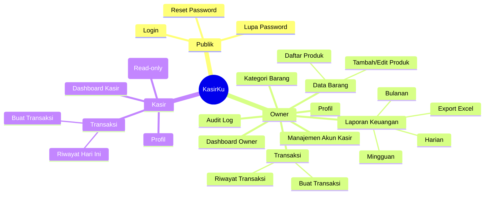
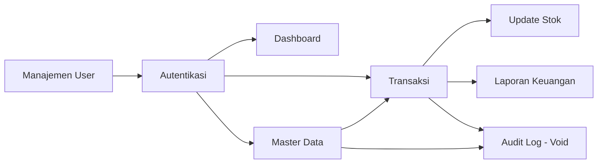
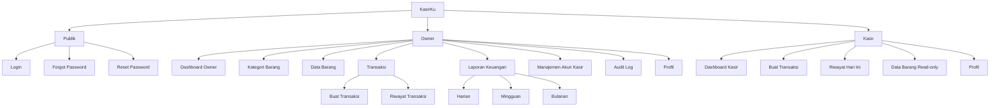
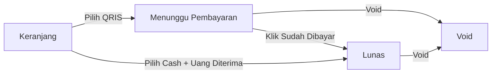

# INFORMATION ARCHITECTURE (IA)
## KasirKu – Sistem Kasir Coffee Shop Sederhana

*Point of Sale (POS) berbasis Web Responsive untuk Coffee Shop*

Versi 1.0.0 | 25 Juni 2026 | Status: DRAFT

---

| Atribut | Detail |
|--------|--------|
| **Nama Dokumen** | Information Architecture |
| **Nama Sistem** | KasirKu *(placeholder — sesuaikan dengan nama coffee shop)* |
| **Versi** | 1.0.0 |
| **Tanggal** | 2026 |
| **Status** | Draft |
| **Referensi** | SRS v1.0.0 |

---

## Daftar Isi

1. [Sitemap](#1-sitemap)
2. [Navigation Structure](#2-navigation-structure)
3. [Menu Structure](#3-menu-structure)
4. [Module Structure](#4-module-structure)
5. [Screen Inventory](#5-screen-inventory)
6. [Page Inventory](#6-page-inventory)
7. [Permission Matrix](#7-permission-matrix)
8. [Taxonomy](#8-taxonomy)
9. [Content Hierarchy](#9-content-hierarchy)
10. [Mobile Navigation](#10-mobile-navigation)
11. [Desktop Navigation](#11-desktop-navigation)
12. [URL Structure](#12-url-structure)
13. [Breadcrumb Strategy](#13-breadcrumb-strategy)
14. [Tree Diagram](#14-tree-diagram)

---

## 1. Sitemap



---

## 2. Navigation Structure

### 2.1 Navigasi Berdasarkan Peran

| Peran | Pola Navigasi Utama | Fokus |
|-------|---------------------|-------|
| **Owner** | Sidebar (desktop) / Bottom Nav + Drawer (mobile) | Kontrol penuh: produk, laporan, user, audit log |
| **Kasir** | Bottom Nav sederhana (mobile/tablet) / Topbar minimal (desktop) | Kecepatan transaksi, akses minim distraksi |

### 2.2 Navigasi Global (Semua Peran)

| Elemen | Keterangan |
|--------|-----------|
| Real-time Clock | Selalu tampil di header/topbar, format `HH:mm:ss · DD MMM YYYY` |
| Avatar/Profil | Pojok kanan atas, dropdown ke Profil & Logout |
| Notifikasi In-App | Toast untuk feedback aksi (sukses/gagal), bukan ikon lonceng terpisah |

### 2.3 Pola Navigasi

- **Owner**: navigasi berbasis sidebar dengan grouping modul (Master Data, Transaksi, Laporan, Pengaturan).
- **Kasir**: navigasi flat 3 item (Kasir/Transaksi, Riwayat, Produk) — sengaja diminimalkan karena device sering tablet/HP di tangan saat melayani customer.

---

## 3. Menu Structure

### 3.1 Menu Owner (Sidebar Desktop)

```
📊 Dashboard
🏷️  Kategori Barang
📦 Data Barang
🧾 Transaksi
   ├─ Buat Transaksi
   └─ Riwayat Transaksi
📈 Laporan Keuangan
   ├─ Harian
   ├─ Mingguan
   └─ Bulanan
👤 Manajemen Akun Kasir
📜 Audit Log
⚙️ Profil
```

### 3.2 Menu Kasir (Bottom Nav)

```
🧾 Kasir (Buat Transaksi)   — halaman utama/default
🕘 Riwayat Hari Ini
📦 Produk (Read-only)
👤 Profil
```

### 3.3 Menu Profil (Dropdown — Semua Peran)

| Item | Aksi |
|------|------|
| Lihat Profil | Buka `/profil` |
| Ubah Password | Buka form ubah password di `/profil` |
| Logout | Akhiri sesi, redirect ke `/login` |

---

## 4. Module Structure

### 4.1 Peta Modul Sistem

| Modul | Sub-modul | Aktor |
|-------|-----------|-------|
| Autentikasi | Login, Forgot Password, Reset Password | Owner, Kasir |
| Manajemen User | CRUD Akun Kasir | Owner |
| Master Data | Kategori Barang, Data Barang | Owner (CRUD), Kasir (read-only) |
| Transaksi | Buat Transaksi (QRIS/Cash), Konfirmasi Pembayaran, Void | Owner, Kasir |
| Laporan | Laporan Harian/Mingguan/Bulanan, Export Excel | Owner |
| Dashboard | Real-time clock, ringkasan, low stock alert | Owner, Kasir (versi terbatas) |
| Audit Log | Log aktivitas void & perubahan kritikal | Owner |

### 4.2 Dependency Antar Modul



---

## 5. Screen Inventory

### 5.1 Halaman Publik (Tanpa Login)

| Halaman | Path |
|---------|------|
| Login | `/login` |
| Lupa Password | `/forgot-password` |
| Reset Password | `/reset-password` |

### 5.2 Halaman Owner

| Halaman | Path |
|---------|------|
| Dashboard Owner | `/dashboard` |
| Kategori Barang | `/kategori` |
| Data Barang | `/produk` |
| Tambah/Edit Produk (modal) | `/produk` *(modal overlay)* |
| Buat Transaksi | `/transaksi` |
| Riwayat Transaksi | `/transaksi/riwayat` |
| Laporan Keuangan | `/laporan` |
| Manajemen Akun Kasir | `/users` |
| Audit Log | `/audit-log` |
| Profil | `/profil` |

### 5.3 Halaman Kasir

| Halaman | Path |
|---------|------|
| Dashboard Kasir | `/dashboard` *(versi konten berbeda dari Owner, route sama)* |
| Buat Transaksi | `/transaksi` |
| Riwayat Transaksi Hari Ini | `/transaksi/riwayat` |
| Data Barang (Read-only) | `/produk` *(kolom HPP disembunyikan)* |
| Profil | `/profil` |

---

## 6. Page Inventory

### 6.1 Dashboard Owner

| Elemen | Deskripsi |
|--------|-----------|
| Real-time Clock | Jam & tanggal berjalan |
| Ringkasan Hari Ini | Total penjualan, jumlah transaksi |
| Low Stock Alert | Daftar produk dengan stok ≤ batas minimum |
| Shortcut | Tombol cepat ke Buat Transaksi & Laporan |

### 6.2 Dashboard Kasir

| Elemen | Deskripsi |
|--------|-----------|
| Real-time Clock | Jam & tanggal berjalan |
| Ringkasan Hari Ini | Total transaksi & jumlah transaksi milik kasir yang login |
| Shortcut | Tombol besar "Buat Transaksi Baru" |

### 6.3 Halaman Buat Transaksi (Kasir/Owner)

| Elemen | Deskripsi |
|--------|-----------|
| Grid Produk | Card produk per kategori (tab filter kategori) |
| Keranjang | Daftar item terpilih + qty + subtotal |
| Total | Total harga keseluruhan |
| Tombol Metode Bayar | QRIS / Cash |
| Panel QRIS | Tampilkan kode QRIS statis + tombol "Sudah Dibayar" |
| Panel Cash | Input "Uang Diterima" + tampilan otomatis "Kembalian" |
| Struk Digital | Preview struk setelah transaksi sukses + tombol share |

### 6.4 Halaman Data Barang

| Elemen | Deskripsi |
|--------|-----------|
| Tabel Produk | Nama, Kategori, Harga Jual, (HPP — Owner saja), Stok, Satuan |
| Filter | Berdasarkan kategori |
| Badge Stok Menipis | Highlight baris dengan stok ≤ batas minimum |
| Tombol Tambah Produk | Hanya tampil untuk Owner |

### 6.5 Halaman Laporan Keuangan

| Elemen | Deskripsi |
|--------|-----------|
| Tab Periode | Harian / Mingguan / Bulanan |
| Date Range Picker | Pilih tanggal/minggu/bulan spesifik |
| Kartu Ringkasan | Total Penjualan, Jumlah Transaksi, Profit/Margin |
| Tabel Produk Terlaris | Rank produk berdasarkan qty terjual |
| Tombol Export Excel | Generate file `.xlsx` |

---

## 7. Permission Matrix

### 7.1 Halaman Publik

| Halaman | Owner | Kasir | Tanpa Login |
|---------|:-----:|:-----:|:-----------:|
| Login | ✅ | ✅ | ✅ |
| Forgot/Reset Password | ✅ | ✅ | ✅ |

### 7.2 Dashboard

| Aksi | Owner | Kasir |
|------|:-----:|:-----:|
| Lihat Dashboard Owner (lengkap) | ✅ | ❌ |
| Lihat Dashboard Kasir (ringkas) | ❌ | ✅ |
| Lihat Low Stock Alert | ✅ | ❌ |

### 7.3 Manajemen User

| Aksi | Owner | Kasir |
|------|:-----:|:-----:|
| Tambah/Edit/Nonaktifkan Akun Kasir | ✅ | ❌ |
| Lihat/Edit Profil Sendiri | ✅ | ✅ |

### 7.4 Master Data

| Aksi | Owner | Kasir |
|------|:-----:|:-----:|
| CRUD Kategori | ✅ | ❌ |
| CRUD Produk | ✅ | ❌ |
| Lihat Daftar Produk (dengan HPP) | ✅ | ❌ |
| Lihat Daftar Produk (tanpa HPP) | ✅ | ✅ |

### 7.5 Transaksi

| Aksi | Owner | Kasir |
|------|:-----:|:-----:|
| Buat Transaksi (QRIS/Cash) | ✅ | ✅ |
| Konfirmasi Pembayaran QRIS | ✅ | ✅ |
| Void Transaksi | ✅ | ✅ *(sendiri)* |
| Lihat Riwayat Transaksi Hari Ini | ✅ | ✅ |
| Lihat Riwayat Transaksi Semua Periode | ✅ | ❌ |

### 7.6 Laporan & Audit Log

| Aksi | Owner | Kasir |
|------|:-----:|:-----:|
| Lihat Laporan Harian/Mingguan/Bulanan | ✅ | ❌ |
| Export Laporan ke Excel | ✅ | ❌ |
| Lihat Audit Log | ✅ | ❌ |

### 7.7 Profil

| Aksi | Owner | Kasir |
|------|:-----:|:-----:|
| Lihat Profil Sendiri | ✅ | ✅ |
| Ubah Password Sendiri | ✅ | ✅ |

---

## 8. Taxonomy

### 8.1 Taksonomi Status Transaksi

| Status | Keterangan |
|--------|-----------|
| Menunggu Pembayaran | Transaksi QRIS dibuat, menunggu konfirmasi manual kasir |
| Lunas | Pembayaran terkonfirmasi (QRIS) atau langsung (Cash) |
| Void | Transaksi dibatalkan, stok dikembalikan |

### 8.2 Taksonomi Metode Bayar

| Metode | Keterangan |
|--------|-----------|
| QRIS | QRIS statis, konfirmasi manual oleh kasir |
| Cash | Tunai, dengan kalkulator kembalian otomatis |

### 8.3 Taksonomi Peran Pengguna

| Peran | Karakteristik |
|-------|---------------|
| Owner | Akses penuh: master data, laporan, user management, audit log |
| Kasir | Akses operasional: transaksi harian, lihat produk (tanpa HPP) |

### 8.4 Taksonomi Periode Laporan

| Periode | Definisi |
|---------|----------|
| Harian | 1 hari kalender (00:00–23:59 WIB) |
| Mingguan | Senin–Minggu |
| Bulanan | Tanggal 1 s/d akhir bulan kalender berjalan |

### 8.5 Taksonomi Kategori Produk

Kategori bersifat dinamis, dikelola Owner (contoh umum: Kopi, Non-Kopi, Makanan, Snack) — tidak hardcoded di sistem.

---

## 9. Content Hierarchy

### 9.1 Hierarki Konten Dashboard Owner

```
Dashboard Owner
├── Header (Real-time Clock + Profil)
├── Kartu Ringkasan Hari Ini
│   ├── Total Penjualan
│   └── Jumlah Transaksi
├── Low Stock Alert
│   └── List produk stok ≤ batas minimum
└── Shortcut Aksi
    ├── Buat Transaksi
    └── Lihat Laporan
```

### 9.2 Hierarki Konten Halaman Buat Transaksi

```
Buat Transaksi
├── Tab Kategori Produk
├── Grid Produk (klik untuk tambah ke keranjang)
├── Panel Keranjang
│   ├── List Item (nama, qty, subtotal)
│   ├── Total Harga
│   └── Tombol Pilih Metode Bayar
└── Panel Pembayaran (kondisional)
    ├── QRIS → kode QR + tombol "Sudah Dibayar"
    └── Cash → input uang diterima + kembalian otomatis
```

### 9.3 Hierarki Konten Halaman Laporan

```
Laporan Keuangan
├── Tab Periode (Harian/Mingguan/Bulanan)
├── Filter Tanggal/Minggu/Bulan
├── Kartu Ringkasan (Total Penjualan, Jumlah Transaksi, Profit)
├── Tabel Produk Terlaris
└── Tombol Export Excel
```

---

## 10. Mobile Navigation

### 10.1 Pola Mobile Navigation

Kasir mayoritas menggunakan tablet/HP saat melayani customer — navigasi mobile didesain **satu tangan, minim langkah**.

### 10.2 Bottom Navigation — Owner (Mobile/Tablet)

```
[Dashboard] [Transaksi] [Produk] [Laporan] [≡ Lainnya]
```
*(Menu "Lainnya" membuka drawer berisi: Kategori, Manajemen User, Audit Log, Profil)*

### 10.3 Bottom Navigation — Kasir (Mobile/Tablet)

```
[Kasir] [Riwayat] [Produk] [Profil]
```

### 10.4 Mobile Interaction Rules

| Aturan | Detail |
|--------|--------|
| Touch Target | Minimum 44x44px untuk semua tombol, terutama tombol produk di grid kasir |
| Grid Produk | 2 kolom di HP, 3-4 kolom di tablet |
| Keranjang | Collapsible bottom sheet di mobile, panel tetap di desktop |
| Numpad Cash | Numpad besar on-screen untuk input uang diterima |

### 10.5 Mobile-Specific Pages

| Halaman | Catatan Mobile |
|---------|----------------|
| Buat Transaksi | Layout 1 kolom: grid produk di atas, keranjang sebagai bottom sheet |
| Panel QRIS | Full-screen modal menampilkan QR + tombol konfirmasi besar |

---

## 11. Desktop Navigation

### 11.1 Pola Desktop Navigation

Owner menggunakan sidebar tetap (fixed) di kiri; Kasir tetap menggunakan layout sederhana karena fokus kerjanya tetap transaksi cepat meski di desktop.

### 11.2 Layout Desktop

```
┌──────────┬────────────────────────────────────┐
│          │  Header: Clock | Profil             │
│ Sidebar  ├────────────────────────────────────┤
│ (Owner)  │                                     │
│          │         Konten Halaman              │
│          │                                     │
└──────────┴────────────────────────────────────┘
```

### 11.3 Sidebar Behavior (Desktop)

| Aturan | Detail |
|--------|--------|
| Default | Expanded, menampilkan ikon + label |
| Collapse | Dapat di-collapse menjadi ikon saja untuk layar lebih sempit |
| Active State | Item menu aktif diberi warna primary + indikator bar kiri |

### 11.4 Header Desktop

| Elemen | Posisi |
|--------|--------|
| Real-time Clock | Kiri/tengah header |
| Nama User & Role | Kanan, sebelah avatar |
| Avatar Dropdown | Paling kanan |

---

## 12. URL Structure

### 12.1 Konvensi URL

- Lowercase, kebab-case untuk multi-kata
- Tidak ada ID di URL untuk halaman list (CRUD ditangani via modal, bukan halaman terpisah)

### 12.2 Halaman Publik

| URL | Halaman |
|-----|---------|
| `/login` | Login |
| `/forgot-password` | Lupa Password |
| `/reset-password` | Reset Password |

### 12.3 Owner & Kasir (Shared Route, konten berbeda per role)

| URL | Halaman |
|-----|---------|
| `/dashboard` | Dashboard |
| `/produk` | Data Barang |
| `/transaksi` | Buat Transaksi |
| `/transaksi/riwayat` | Riwayat Transaksi |
| `/profil` | Profil |

### 12.4 Khusus Owner

| URL | Halaman |
|-----|---------|
| `/kategori` | Kategori Barang |
| `/laporan` | Laporan Keuangan |
| `/users` | Manajemen Akun Kasir |
| `/audit-log` | Audit Log |

### 12.5 API Endpoint (Referensi)

| Endpoint | Method | Keterangan |
|----------|--------|-----------|
| `/api/produk` | GET/POST | List & tambah produk |
| `/api/produk/[id]` | PUT/DELETE | Edit & hapus produk |
| `/api/kategori` | GET/POST | List & tambah kategori |
| `/api/transaksi` | GET/POST | List & buat transaksi |
| `/api/transaksi/[id]/konfirmasi` | POST | Konfirmasi pembayaran QRIS |
| `/api/transaksi/[id]/void` | POST | Void transaksi |
| `/api/laporan` | GET | Data laporan keuangan |
| `/api/laporan/export` | GET | Export Excel |
| `/api/users` | GET/POST | List & tambah akun kasir |
| `/api/audit-log` | GET | List audit log |

---

## 13. Breadcrumb Strategy

### 13.1 Aturan Breadcrumb

- Breadcrumb hanya ditampilkan untuk halaman Owner dengan kedalaman > 1 level.
- Halaman Kasir **tidak menggunakan breadcrumb** — navigasi flat, fokus kecepatan.

### 13.2 Contoh Breadcrumb per Halaman

| Halaman | Breadcrumb |
|---------|-----------|
| `/laporan` | Dashboard › Laporan Keuangan |
| `/transaksi/riwayat` | Dashboard › Transaksi › Riwayat |
| `/users` | Dashboard › Manajemen Akun Kasir |

---

## 14. Tree Diagram

### 14.1 Tree Diagram Lengkap Sistem KasirKu



### 14.2 Tree Diagram Alur Status Transaksi



---

## Ringkasan Information Architecture

KasirKu menggunakan struktur navigasi dua arah — **Owner** dengan sidebar lengkap untuk kontrol penuh sistem, dan **Kasir** dengan navigasi flat super-sederhana yang dioptimalkan untuk kecepatan transaksi di lantai toko. Route `/dashboard`, `/produk`, `/transaksi`, dan `/profil` dibagi antar kedua role dengan konten yang disesuaikan (conditional rendering berbasis role), sementara `/kategori`, `/laporan`, `/users`, dan `/audit-log` eksklusif untuk Owner.

---

*Dokumen ini merupakan bagian dari Source of Truth (SOT) proyek KasirKu.*
*Referensi silang wajib dengan: User Flow, Design System, dan Software Requirement Specification.*