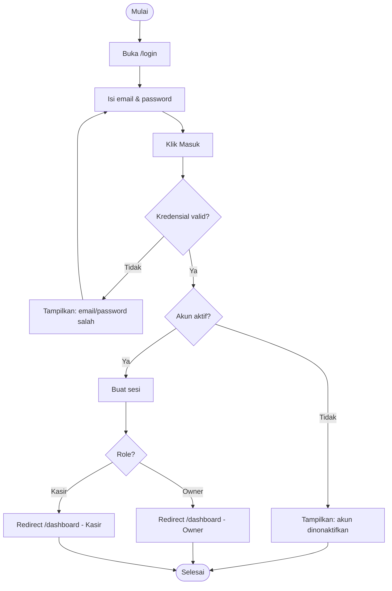
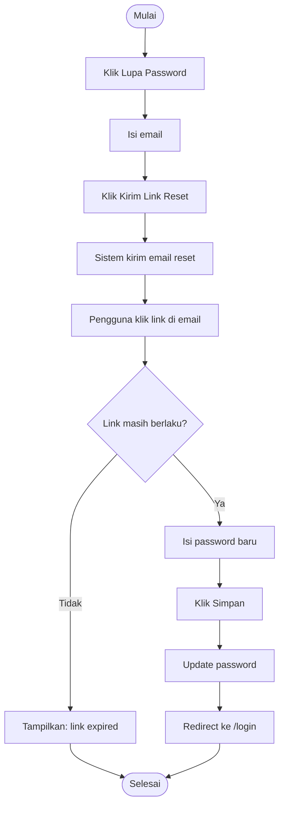
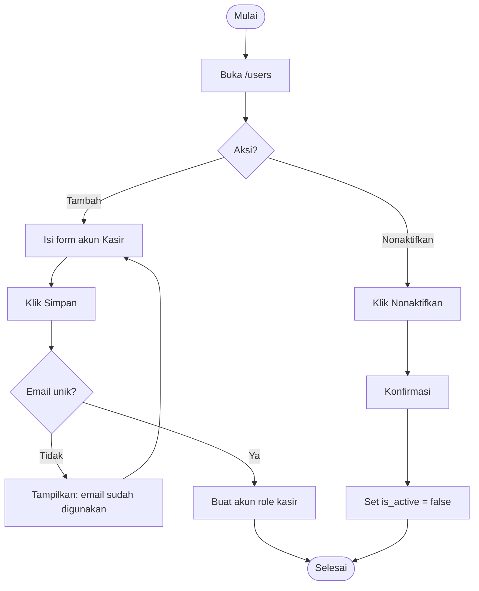
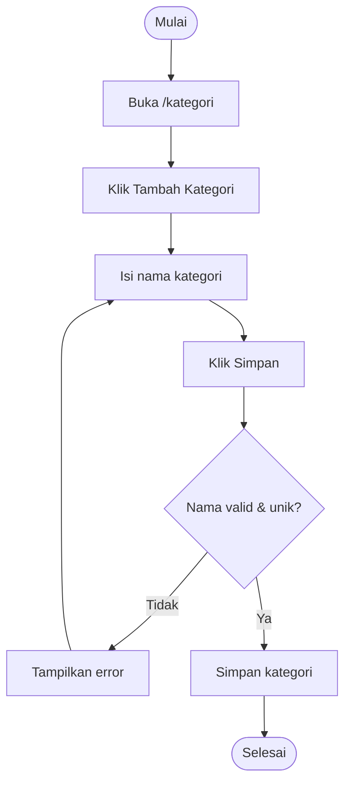
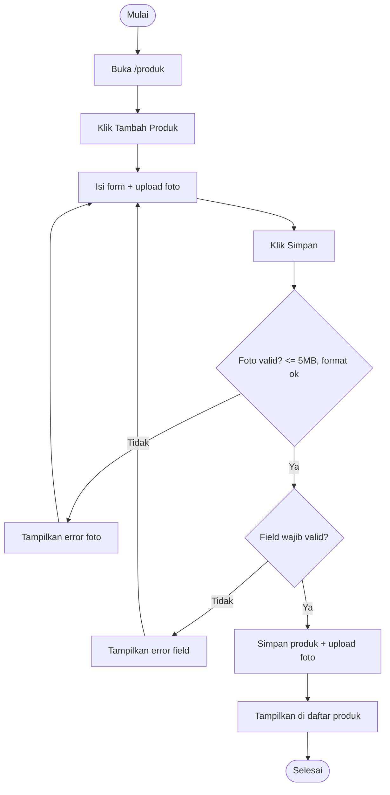
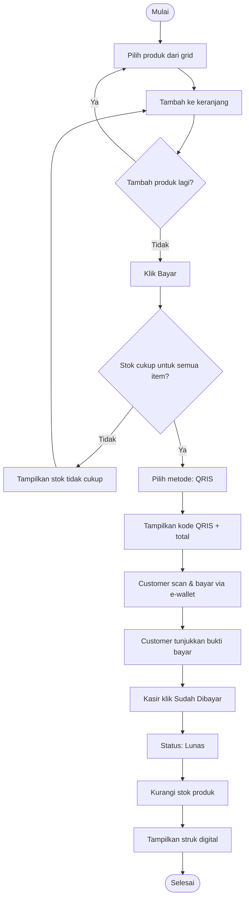
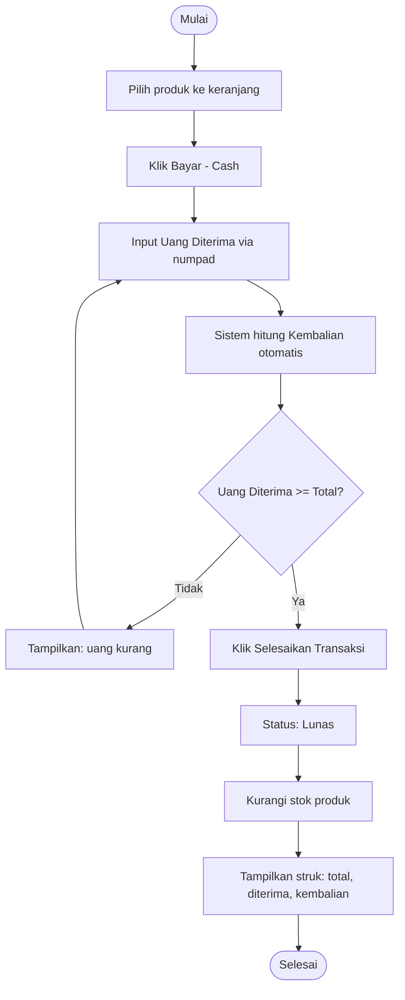
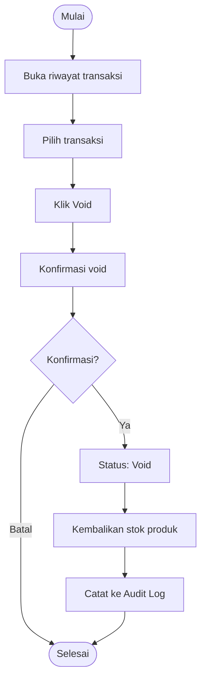
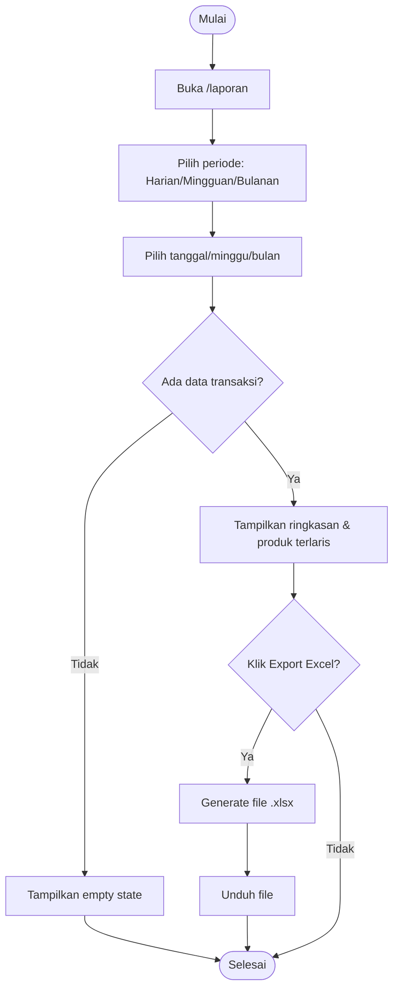
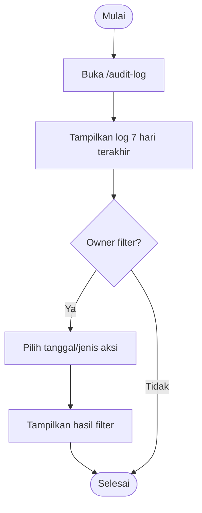

# USER FLOW (UF)
## KasirKu – Sistem Kasir Coffee Shop Sederhana

*Point of Sale (POS) berbasis Web Responsive untuk Coffee Shop*

Versi 1.0.0 | 25 Juni 2026 | Status: DRAFT

---

| Atribut | Detail |
|--------|--------|
| **Nama Dokumen** | User Flow |
| **Nama Sistem** | KasirKu *(placeholder — sesuaikan dengan nama coffee shop)* |
| **Versi** | 1.0.0 |
| **Tanggal** | 2026 |
| **Status** | Draft |
| **Referensi** | SRS v1.0.0 |

---

## Daftar Isi

1. [UF-01 Login](#uf-01-login)
2. [UF-02 Forgot Password](#uf-02-forgot-password)
3. [UF-03 Kelola Akun Kasir](#uf-03-kelola-akun-kasir)
4. [UF-04 Kelola Kategori Barang](#uf-04-kelola-kategori-barang)
5. [UF-05 Kelola Data Barang](#uf-05-kelola-data-barang)
6. [UF-06 Buat Transaksi — QRIS](#uf-06-buat-transaksi--qris)
7. [UF-07 Buat Transaksi — Cash](#uf-07-buat-transaksi--cash)
8. [UF-08 Void Transaksi](#uf-08-void-transaksi)
9. [UF-09 Lihat & Export Laporan Keuangan](#uf-09-lihat--export-laporan-keuangan)
10. [UF-10 Lihat Audit Log](#uf-10-lihat-audit-log)

---

## UF-01: Login

| Atribut | Detail |
|---------|--------|
| **Flow Name** | Login |
| **Actor** | Owner / Kasir |
| **Trigger** | Pengguna membuka aplikasi |
| **Preconditions** | Pengguna memiliki akun aktif (dibuat oleh Owner) |
| **Post Conditions** | Pengguna terautentikasi, redirect ke `/dashboard` sesuai role |

### Main Flow

| Step | Actor | Aksi |
|------|-------|------|
| 1 | Pengguna | Membuka `/login` |
| 2 | Sistem | Menampilkan form email & password |
| 3 | Pengguna | Mengisi email & password, klik **Masuk** |
| 4 | Sistem | Memvalidasi kredensial via Supabase Auth |
| 5 | Sistem | Membuat sesi & menentukan role (Owner/Kasir) |
| 6 | Sistem | Redirect ke `/dashboard` dengan konten sesuai role |

### Alternative Flow

| Kode | Kondisi | Aksi |
|------|---------|------|
| A1 | Pengguna belum logout sebelumnya (sesi masih aktif) | Langsung redirect ke `/dashboard` tanpa form login |

### Exception Flow

| Kode | Kondisi | Aksi |
|------|---------|------|
| E1 | Email/password salah | Tampilkan: *"Email atau password salah"* |
| E2 | Akun dinonaktifkan Owner | Tampilkan: *"Akun Anda telah dinonaktifkan, hubungi Owner"* |

### Validation Rules

| Field | Rule |
|-------|------|
| Email | Wajib, format email valid |
| Password | Wajib, minimal 8 karakter |

### Error Scenario

| Skenario | Pesan |
|----------|-------|
| Kredensial salah 5x berturut-turut | *"Terlalu banyak percobaan, coba lagi dalam 5 menit"* |

### Mermaid Flowchart

---

## UF-02: Forgot Password

| Atribut | Detail |
|---------|--------|
| **Flow Name** | Forgot Password |
| **Actor** | Owner / Kasir |
| **Trigger** | Pengguna klik "Lupa Password" di halaman login |
| **Preconditions** | Pengguna memiliki akun terdaftar |
| **Post Conditions** | Password berhasil diubah, pengguna dapat login dengan password baru |

### Main Flow

| Step | Actor | Aksi |
|------|-------|------|
| 1 | Pengguna | Klik "Lupa Password" di `/login` |
| 2 | Sistem | Tampilkan form input email di `/forgot-password` |
| 3 | Pengguna | Masukkan email, klik **Kirim Link Reset** |
| 4 | Sistem | Kirim email reset password via Supabase Auth (link berlaku 1 jam) |
| 5 | Pengguna | Klik link di email, dibawa ke `/reset-password` |
| 6 | Pengguna | Masukkan password baru, klik **Simpan** |
| 7 | Sistem | Update password, redirect ke `/login` |

### Exception Flow

| Kode | Kondisi | Aksi |
|------|---------|------|
| E1 | Email tidak terdaftar | Tampilkan pesan generik: *"Jika email terdaftar, link reset telah dikirim"* (anti email enumeration) |
| E2 | Link reset expired (>1 jam) | Tampilkan: *"Link sudah tidak berlaku, minta link baru"* |

### Validation Rules

| Field | Rule |
|-------|------|
| Email | Wajib, format email valid |
| Password Baru | Wajib, minimal 8 karakter |

### Mermaid Flowchart

---

## UF-03: Kelola Akun Kasir

| Atribut | Detail |
|---------|--------|
| **Flow Name** | Kelola Akun Kasir |
| **Actor** | Owner |
| **Trigger** | Owner membuka `/users` |
| **Preconditions** | Owner sudah login |
| **Post Conditions** | Akun Kasir baru aktif / akun Kasir lama dinonaktifkan |

### Main Flow — Tambah Akun Kasir

| Step | Actor | Aksi |
|------|-------|------|
| 1 | Owner | Membuka `/users`, klik **Tambah Kasir** |
| 2 | Sistem | Tampilkan form: nama, email, password sementara |
| 3 | Owner | Isi form, klik **Simpan** |
| 4 | Sistem | Buat akun via Supabase Auth dengan role `kasir` |
| 5 | Sistem | Tampilkan akun baru di daftar |

### Main Flow — Nonaktifkan Akun Kasir

| Step | Actor | Aksi |
|------|-------|------|
| 1 | Owner | Klik **Nonaktifkan** pada baris akun Kasir |
| 2 | Sistem | Tampilkan konfirmasi |
| 3 | Owner | Konfirmasi |
| 4 | Sistem | Set `is_active = false`, akun tidak bisa login lagi |

### Exception Flow

| Kode | Kondisi | Aksi |
|------|---------|------|
| E1 | Email sudah terdaftar | Tampilkan: *"Email sudah digunakan"* |

### Validation Rules

| Field | Rule |
|-------|------|
| Nama | Wajib, min 3 karakter |
| Email | Wajib, format valid, unik |
| Password Sementara | Wajib, minimal 8 karakter |

### Mermaid Flowchart

---

## UF-04: Kelola Kategori Barang

| Atribut | Detail |
|---------|--------|
| **Flow Name** | Kelola Kategori Barang |
| **Actor** | Owner |
| **Trigger** | Owner membuka `/kategori` |
| **Preconditions** | Owner sudah login |
| **Post Conditions** | Kategori tersimpan dan dapat dipilih saat input produk |

### Main Flow — Tambah Kategori

| Step | Actor | Aksi |
|------|-------|------|
| 1 | Owner | Buka `/kategori`, klik **Tambah Kategori** |
| 2 | Sistem | Tampilkan form input nama kategori |
| 3 | Owner | Isi nama kategori, klik **Simpan** |
| 4 | Sistem | Simpan kategori, tampilkan di daftar |

### Exception Flow

| Kode | Kondisi | Aksi |
|------|---------|------|
| E1 | Nama kategori kosong | Tampilkan: *"Nama kategori wajib diisi"* |
| E2 | Hapus kategori yang masih punya produk | Tampilkan: *"Kategori masih digunakan, pindahkan produk terlebih dahulu"* |

### Validation Rules

| Field | Rule |
|-------|------|
| Nama Kategori | Wajib, max 50 karakter, unik |

### Mermaid Flowchart

---

## UF-05: Kelola Data Barang

| Atribut | Detail |
|---------|--------|
| **Flow Name** | Kelola Data Barang |
| **Actor** | Owner |
| **Trigger** | Owner membuka `/produk` |
| **Preconditions** | Minimal 1 kategori sudah dibuat |
| **Post Conditions** | Produk tersedia untuk dijual di halaman Transaksi |

### Main Flow — Tambah Produk

| Step | Actor | Aksi |
|------|-------|------|
| 1 | Owner | Buka `/produk`, klik **Tambah Produk** |
| 2 | Sistem | Tampilkan form: nama, kategori, kode/SKU, deskripsi, satuan, harga jual, harga modal (HPP), stok awal, foto |
| 3 | Owner | Isi semua field, upload foto (maks. 5MB) |
| 4 | Owner | Klik **Simpan** |
| 5 | Sistem | Validasi & simpan produk, upload foto ke Supabase Storage |
| 6 | Sistem | Tampilkan produk baru di daftar & grid transaksi |

### Exception Flow

| Kode | Kondisi | Aksi |
|------|---------|------|
| E1 | Foto > 5MB | Tampilkan: *"Ukuran foto maksimal 5MB"* |
| E2 | Format foto tidak didukung | Tampilkan: *"Format harus jpg/png/webp"* |
| E3 | Harga jual ≤ harga modal | Tampilkan peringatan: *"Harga jual lebih rendah dari harga modal, profit negatif"* (tetap bisa disimpan, hanya warning) |

### Validation Rules

| Field | Rule |
|-------|------|
| Nama Produk | Wajib, max 100 karakter |
| Kategori | Wajib pilih salah satu |
| Harga Jual | Wajib, numerik, > 0 |
| Harga Modal (HPP) | Wajib, numerik, ≥ 0 |
| Stok | Wajib, integer, ≥ 0 |
| Foto | Opsional, maks 5MB, format jpg/png/webp |

### Mermaid Flowchart

---

## UF-06: Buat Transaksi — QRIS

| Atribut | Detail |
|---------|--------|
| **Flow Name** | Buat Transaksi dengan QRIS Statis |
| **Actor** | Owner / Kasir |
| **Trigger** | Kasir membuka `/transaksi` dan customer memilih bayar QRIS |
| **Preconditions** | Minimal 1 produk dengan stok > 0 tersedia |
| **Post Conditions** | Transaksi berstatus **Lunas**, stok berkurang, struk digital tampil |

### Main Flow

| Step | Actor | Aksi |
|------|-------|------|
| 1 | Kasir | Buka `/transaksi`, pilih produk dari grid (per kategori) |
| 2 | Sistem | Tambahkan produk ke keranjang, hitung subtotal & total |
| 3 | Kasir | Klik **Bayar**, pilih metode **QRIS** |
| 4 | Sistem | Tampilkan kode QRIS statis (full-screen di mobile) + total yang harus dibayar |
| 5 | Customer | Scan QRIS via app e-wallet/bank, input nominal sesuai total, bayar |
| 6 | Customer | Tunjukkan bukti pembayaran ke kasir |
| 7 | Kasir | Klik tombol **"Sudah Dibayar"** |
| 8 | Sistem | Update status transaksi → **Lunas**, kurangi stok produk sesuai qty, catat `dibayar_at` |
| 9 | Sistem | Tampilkan struk digital (preview + tombol share) |

### Alternative Flow

| Kode | Kondisi | Aksi |
|------|---------|------|
| A1 | Customer batal bayar sebelum konfirmasi | Kasir klik **Batalkan**, keranjang/transaksi dihapus (belum lunas, belum potong stok) |

### Exception Flow

| Kode | Kondisi | Aksi |
|------|---------|------|
| E1 | Salah satu produk di keranjang stok = 0 saat checkout | Sistem blokir, tampilkan: *"Stok [Nama Produk] habis, hapus dari keranjang"* |
| E2 | Qty di keranjang > stok tersedia | Sistem blokir checkout, tampilkan sisa stok aktual |

### Validation Rules

| Aturan | Detail |
|--------|--------|
| Stok | Qty di keranjang tidak boleh melebihi stok tersedia |
| Total | Wajib > 0 untuk dapat checkout |

### Mermaid Flowchart

---

## UF-07: Buat Transaksi — Cash

| Atribut | Detail |
|---------|--------|
| **Flow Name** | Buat Transaksi dengan Tunai (Cash) |
| **Actor** | Owner / Kasir |
| **Trigger** | Kasir membuka `/transaksi` dan customer memilih bayar tunai |
| **Preconditions** | Minimal 1 produk dengan stok > 0 tersedia |
| **Post Conditions** | Transaksi berstatus **Lunas**, stok berkurang, kembalian ditampilkan, struk digital tampil |

### Main Flow

| Step | Actor | Aksi |
|------|-------|------|
| 1 | Kasir | Pilih produk dari grid, item masuk ke keranjang |
| 2 | Kasir | Klik **Bayar**, pilih metode **Cash** |
| 3 | Sistem | Tampilkan input numpad "Uang Diterima" |
| 4 | Kasir | Masukkan nominal uang yang diterima dari customer |
| 5 | Sistem | Hitung otomatis: **Kembalian = Uang Diterima − Total** |
| 6 | Kasir | Klik **Selesaikan Transaksi** |
| 7 | Sistem | Update status → **Lunas**, kurangi stok, catat `uang_diterima` & `kembalian` |
| 8 | Sistem | Tampilkan struk digital berisi total, uang diterima, dan kembalian |

### Exception Flow

| Kode | Kondisi | Aksi |
|------|---------|------|
| E1 | Uang diterima < Total | Sistem blokir tombol selesai, tampilkan: *"Uang diterima kurang dari total"* |
| E2 | Stok tidak cukup (sama seperti UF-06 E1/E2) | Blokir checkout |

### Validation Rules

| Field | Rule |
|-------|------|
| Uang Diterima | Wajib, numerik, ≥ Total transaksi |

### Mermaid Flowchart

---

## UF-08: Void Transaksi

| Atribut | Detail |
|---------|--------|
| **Flow Name** | Void Transaksi |
| **Actor** | Owner / Kasir |
| **Trigger** | Kasir membuka riwayat transaksi dan memilih transaksi yang salah |
| **Preconditions** | Transaksi berstatus Menunggu Pembayaran atau Lunas |
| **Post Conditions** | Transaksi berstatus **Void**, stok dikembalikan, tercatat di Audit Log |

### Main Flow

| Step | Actor | Aksi |
|------|-------|------|
| 1 | Kasir | Buka `/transaksi/riwayat`, pilih transaksi yang ingin di-void |
| 2 | Sistem | Tampilkan detail transaksi + tombol **Void** |
| 3 | Kasir | Klik **Void** |
| 4 | Sistem | Tampilkan konfirmasi: *"Yakin void transaksi [No. Transaksi]?"* |
| 5 | Kasir | Konfirmasi |
| 6 | Sistem | Update status → **Void**, kembalikan stok produk sesuai qty, catat `void_at` |
| 7 | Sistem | Tulis entri ke Audit Log: siapa, kapan, transaksi mana |

### Business Rules pada Step 6-7

| Aturan | Detail |
|--------|--------|
| Tanpa Approval | Kasir dapat void transaksi sendiri tanpa perlu approval Owner |
| Restore Stok | Stok produk yang terjual di transaksi tersebut dikembalikan sepenuhnya |
| Wajib Tercatat | Aksi void wajib masuk Audit Log agar Owner dapat mereview |

### Mermaid Flowchart

---

## UF-09: Lihat & Export Laporan Keuangan

| Atribut | Detail |
|---------|--------|
| **Flow Name** | Lihat & Export Laporan Keuangan |
| **Actor** | Owner |
| **Trigger** | Owner membuka `/laporan` |
| **Preconditions** | Owner sudah login; ada data transaksi Lunas |
| **Post Conditions** | Laporan tampil di layar dan/atau file Excel berhasil diunduh |

### Main Flow

| Step | Actor | Aksi |
|------|-------|------|
| 1 | Owner | Buka `/laporan` |
| 2 | Owner | Pilih tab periode: Harian / Mingguan / Bulanan |
| 3 | Owner | Pilih tanggal/minggu/bulan spesifik |
| 4 | Sistem | Hitung & tampilkan: Total Penjualan, Jumlah Transaksi, Produk Terlaris, Profit/Margin |
| 5 | Owner | Klik **Export ke Excel** |
| 6 | Sistem | Generate file `.xlsx` dan unduh otomatis |

### Exception Flow

| Kode | Kondisi | Aksi |
|------|---------|------|
| E1 | Tidak ada transaksi pada periode terpilih | Tampilkan empty state: *"Belum ada transaksi pada periode ini"* |

### Mermaid Flowchart

---

## UF-10: Lihat Audit Log

| Atribut | Detail |
|---------|--------|
| **Flow Name** | Lihat Audit Log |
| **Actor** | Owner |
| **Trigger** | Owner membuka `/audit-log` |
| **Preconditions** | Owner sudah login |
| **Post Conditions** | Owner dapat melihat & memfilter riwayat aksi kritikal (terutama void) |

### Main Flow

| Step | Actor | Aksi |
|------|-------|------|
| 1 | Owner | Buka `/audit-log` |
| 2 | Sistem | Tampilkan tabel log: waktu, user, aksi, entitas terkait, detail |
| 3 | Owner | Filter berdasarkan tanggal atau jenis aksi (mis. hanya VOID_TRANSAKSI) |
| 4 | Sistem | Tampilkan hasil sesuai filter |

### Validation Rules

| Field | Rule |
|-------|------|
| Filter Tanggal | Opsional, default 7 hari terakhir |

### Mermaid Flowchart

---

## Ringkasan User Flow

Sepuluh flow di atas mencakup seluruh siklus operasional KasirKu: dari autentikasi (UF-01, UF-02), pengelolaan master data oleh Owner (UF-03, UF-04, UF-05), inti transaksi dengan dua metode bayar (UF-06 QRIS, UF-07 Cash), kontrol kesalahan via void (UF-08), hingga pelaporan dan akuntabilitas (UF-09, UF-10). Poin kritikal yang konsisten muncul di seluruh flow transaksi adalah **validasi stok sebelum checkout** dan **pencatatan wajib ke Audit Log untuk aksi void**, sesuai Business Rules pada SRS.

---

*Dokumen ini merupakan bagian dari Source of Truth (SOT) proyek KasirKu.*
*Referensi silang wajib dengan: Information Architecture, Design System, dan Software Requirement Specification.*